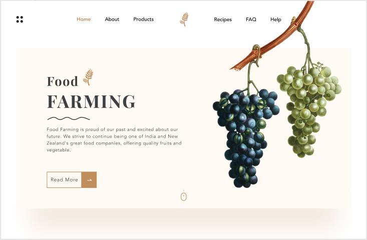

# Site Food farming

> Pagina principal de um site feito por mim usando referencia itens do figma

### Ajustes e melhorias

O projeto ainda está em desenvolvimento e as próximas atualizações serão voltadas nas seguintes tarefas:

- [x] Uso de HTMl
- [x] Uso de CSS

## 🤝 Colaboradores

Agradecemos às seguintes pessoas que contribuíram para este projeto:

<table>
  <tr>
    <td align="center">
      <a href="https://www.linkedin.com/in/natanael-evangelista-martins-792777223/">
         
        
          <b>Natanael</b>
        
      </a>
    </td>
    
  </tr>
</table>

[⬆ Voltar ao topo](#Food-Farming) 
